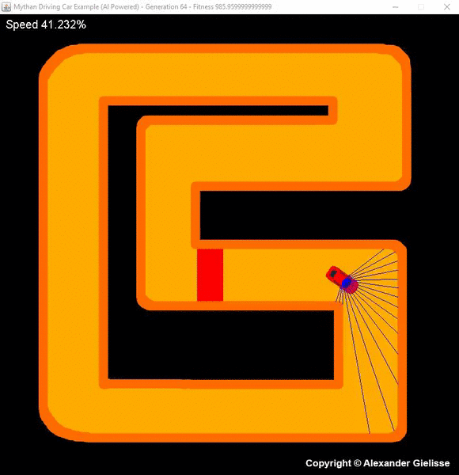
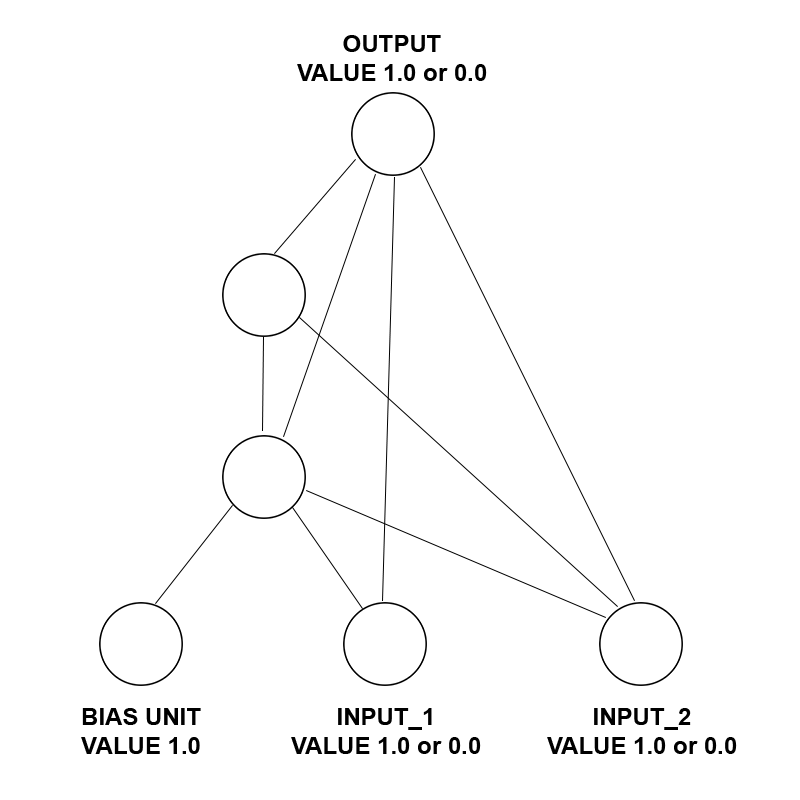

# Mythan
Mythan is a single-threaded Java implementation of the Neuroevolution of Augmenting Topologies algorithm (NEAT) as described by Kenneth O. Stanley and Risto Miikkulainen. You can find their paper [here](http://nn.cs.utexas.edu/downloads/papers/stanley.ec02.pdf). 

I started this project out of interest for neural networks. I got inspired by the hundreds of YouTube video's showing very cool applications of NEAT. Instead of using an existing library or external program, I chose to write my own library in Java so I can understand exactly what happens internally when executed.

Please note, this library uses the NEAT algorithm, not the HyperNEAT algorithm.

# Examples
So far, I've made two examples, which you can find in the /src/examples folder. They are described below.

Car
=========
This example is a car being trained to drive a parcour as fast as possible. The car has 17 antennae. The antennae change their lengths depending on the distance to the wall, as shown in the image below. The network has 18 inputs and 2 outputs. The first 17 inputs are the individual lengths of the 17 antennae. The 18th input is the current speed. The speed is scaled from 0 - 12 to 0 - 1. The car will never be able to drive slower than 4, because then the car might be able to make a turn during its run, which would make fitness calculations a lot harder. The length of the antennae are scaled from 0 - 200 (and therefore capped at 200) to 0 - 1. The first output determines which direction to steer to. The second output determines whether the car should speed up or slow down. The image below shows the car after 64 generations.

XOR
=========
The image below shows a random network generated by Mythan for XOR trained to an error of only 1,25%.

